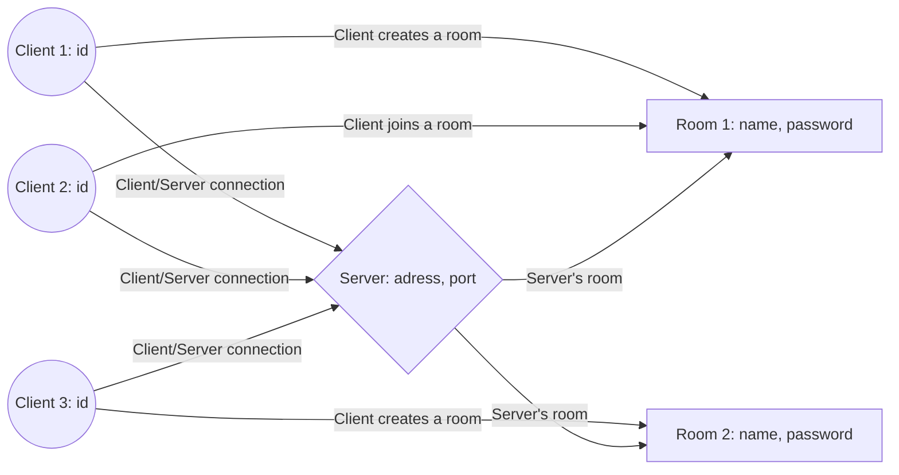

# websocket-chat-client

A node.js software that communicates with a chat server using WebSockets.

> **Note:** This program is a draft and will serve as a basis for more complete programs with graphical interfaces.
It has been developed only to test the websocket server.

# Require

A websocket chat server with a room system.
Refer to the "websocket-chat-server" repository (https://github.com/vavarm/websocket-chat-server)

# Includes

npm modules:
|Name            |Description                     |Link                                       |
|----------------|--------------------------------|-------------------------------------------|
|ws              |WebSocket Library               |https://www.npmjs.com/package/ws           |
|readline-Sync   |Interactive readline in terminal|https://www.npmjs.com/package/readline-sync|

# Graph

